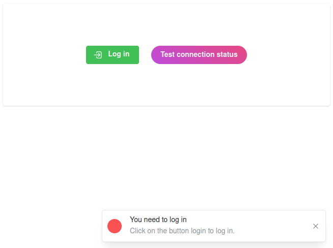
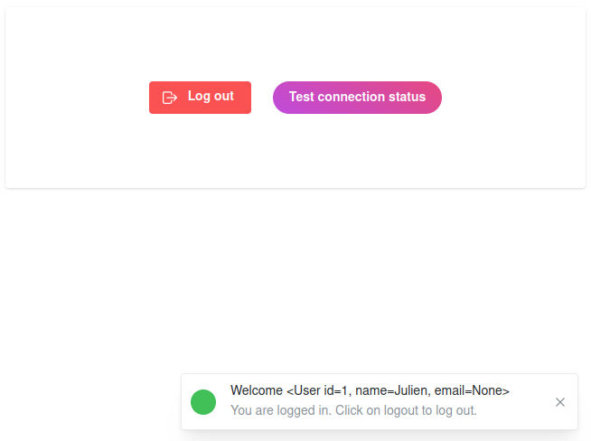

# Proof of concept using Dash and Flask multipass

This repository contains necessary steps to provide a robust authentication system in your Python [Dash](https://dash.plotly.com/) application.

## Concept

### Goal

Our goal is to develop a secured application with the following requirements:
1. We do not want to deal with registration ourselves (authorization & authentication)
2. We want to use a standard protocol for authorization
3. We want to use a standard protocol for authentication

Regarding the first point, we want to delegate to external providers that would allow the use of their authentication on our application. They will take care of the authentication of users (`AuthProvider`) or assigning identity information like name, email, address etc. to users (`IdentityProvider`). There are many external providers, but in this tutorial, we will focus on **GitHub**.

Regarding authorization protocol, we will use **OAuth** (Open Authorization) which is an open standard protocol that allows secure authorization in a standard way for web, mobile, and desktop applications. It enables a user to grant a third-party application limited access to their resources without sharing their credentials directly. This is commonly used for allowing users to log in to a website or app using their existing accounts on other services, such as logging in to a website using your GitHub account.

For the authentication, we will use **OpenID Connect (OIDC)**. It is an authentication layer built on top of OAuth 2.0 protocol. OIDC allows clients to verify the identity of the end-user based on the authentication performed by an authorization server, as well as to obtain basic profile information about the user. It provides a standard way for clients to verify the identity of the end-user and to obtain basic profile information about the user. In simpler terms, OIDC is used for authentication, while OAuth is used for authorization.

### Toolbox

Dash is a Python framework for building analytical web applications. It is built on top of Flask, Plotly.js, and React.js, and allows you to create interactive, web-based data visualizations with just a few lines of Python code. Dash provides a high-level interface for creating web applications without needing to write HTML, CSS, or JavaScript. It is commonly used for creating interactive dashboards, data visualization tools, and other web applications that require data analysis and visualization capabilities.

The world of Flask and Dash has many options for securing an application (see e.g. [dash_auth](https://dash.plotly.com/authentication)), but most of them rely on local providers (a local database), or are unmaintained or completely outdated as of 2024.

We will use [Flask-Multipass](https://flask-multipass.readthedocs.io) which is an extension for Flask. As of 2024, Flask-Multipass is developed by CERN, and it is used in production for Indico (which gives me confidence in the fact it will not be abandoned soon).

Flask-Multipass provides a simple way to integrate multiple authentication providers into a Flask application. It allows you to authenticate users using various identity providers such as LDAP, OAuth, OpenID, and more. This extension simplifies the process of integrating different authentication methods into your Flask application, making it easier to manage user authentication and authorization.

## Implementation

First clone the repository on your machine:

```
git clone https://github.com/JulienPeloton/dash_multipass.git
```

### Registering your app in GitHub

First one needs to register our future application in GitHub. Follow these steps:

1. Sign in to your GitHub account.
2. Go to your account settings by clicking on your profile icon in the top right corner and selecting `Settings` from the dropdown menu.
3. In the left sidebar, click on `Developer settings.`
4. Click on `OAuth Apps` in the developer settings menu.
5. Click on the `New OAuth App` button.
6. Fill in the required information for your app, including the `Application name`, `Homepage URL`, `Application description`, and `Authorization callback URL`.
7. Click on the `Register application` button to create your app.
8. Once your app is registered, you will receive a `Client ID` and `Client Secret` that you can use to authenticate your app with GitHub's API.

In our case, it is important to use:

```
Homepage URL = http://localhost:8050
Authorization callback URL = http://localhost:8050
```

The remaining fields have no importance for this tutorial.

### Configuration

Back on our computer, our application needs to be configured. All configuration parameters will be stored in a file called `configuration.cfg`. Create this file at the root of the repository, and follow the steps:

First, we need to provide the authentication and identification providers. In our case, we will use twice GitHub:

```python
MULTIPASS_AUTH_PROVIDERS = {
    'github': {
        'type': 'authlib',
        'title': 'GitHub',
        'authlib_args': {
            'client_id': '<put your client id here>',
            'client_secret': '<put your client secret here>',
            'client_kwargs': {'scope': 'user:email'},
            'authorize_url': 'https://github.com/login/oauth/authorize',
            'access_token_url': 'https://github.com/login/oauth/access_token',
            'userinfo_endpoint': 'https://api.github.com/user',
        }
    }
}

MULTIPASS_IDENTITY_PROVIDERS = {
    'github': {
        'type': 'authlib',
        'identifier_field': 'id',
        'mapping': {
            'user_name': 'login',
            'affiliation': 'company'
        }
    }
}

MULTIPASS_PROVIDER_MAP = {
    'github': 'github'
}

```

The minimum change for it to work is to provide your `client_id` and `client_secret` that you received when registering your application in GitHub (see above). Then provide these fields:

```python
# Template with selection of login providers
MULTIPASS_LOGIN_SELECTOR_TEMPLATE = 'login_selector.html'

# Endpoint linking to default page after successful login
# Should correspond to what has been entered in
# the GitHub registration form above
MULTIPASS_SUCCESS_ENDPOINT = '/'

# Keys used for identification
MULTIPASS_IDENTITY_INFO_KEYS = ['email', 'name', 'affiliation']

# List of possible login URLs
MULTIPASS_LOGIN_URLS = {'/login/', '/login/<provider>'}
```

Note that `MULTIPASS_SUCCESS_ENDPOINT` and `MULTIPASS_LOGIN_URLS` must be implemented in your code. In this example, this is done in [routes.py](routes.py). We will rely on a local database once the user is logged in. In this project we rely on [Flask-SQLAlchemy](https://flask-sqlalchemy.palletsprojects.com), and we use the simplest option:

```python
SQLALCHEMY_DATABASE_URI = "sqlite:///project.db"
```

Finally provide host and port for the project:

```python
PROJECT_URL = "localhost"
PROJECT_PORT = 8050
```

Note that this should match what you declared in the GitHub registration form.

### Dependencies

Just create a virtual environment, and install dependencies:

```bash
python -m venv .venv
source .venv/bin/activate
pip install -r requirements.txt
```

## Launching the application

Make sure you are in the virtual environment, and launch the application with

```bash
python index.py
```

Then go to `localhost:8050`. You will see two buttons:
- `Log in`: click to log in
- `Test connection status`: click to check whether you are logged in or out.

If you first click on `Test connection status`, you will see a notification telling you that you are logged out:



If you now click on `Log in`, you should see the button changing title and color, and if you click on `Test connection status` again, it will confirm you are logged in:



